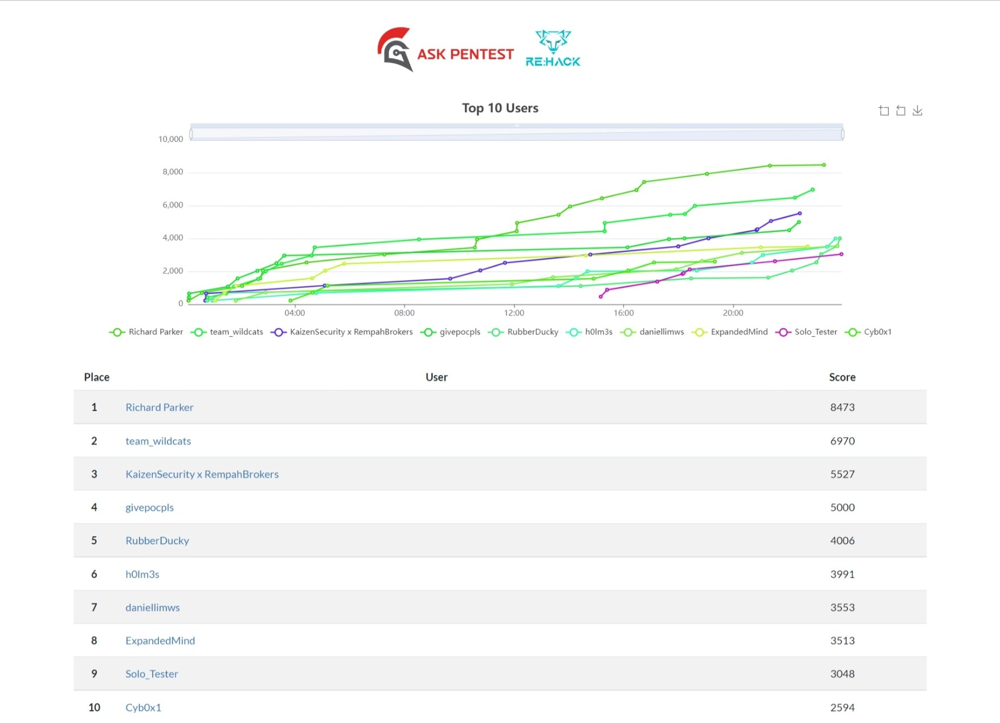
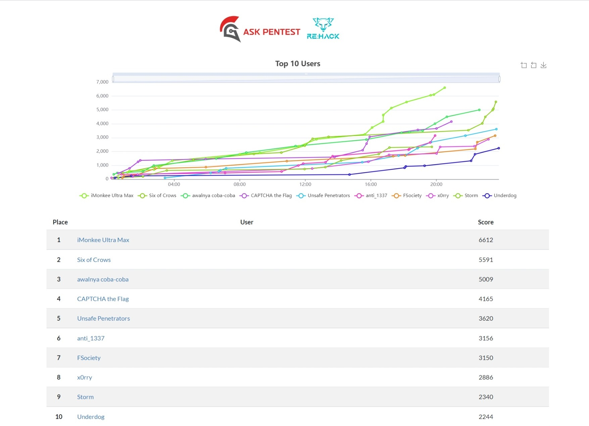

# Wargames.MY CTF 2022
#### *Date*

```text
START: 24 December 2020 00:00 GMT+8 | END: 25 December 2020 00:00 GMT+8
```

#### *Rules*

```text
We try hard to keep the competition as free and exciting as possible; however, we do require players to adhere to a few simple rules:

    1. Maximum of THREE(3) people per team.
    2. No off-the-shelf automated scanning tools such as Nessus, OpenVAS, etc. It's useless and we'll kick you out for that lame ass shit.
    3. No cooperation between players with independent accounts. Sharing of flags or providing revealing hints to other players is cheating, don't do it.
    4. No attacking the competition infrastructure. If bugs or vulns are found, please alert the competition organizers immediately
    5. Absolutely NO sabotaging of other competing players, or in any way hindering their independent progress.
    6. No brute forcing of challenge flag / keys against the scoring server
    7. No flooding and / or DoS attacks. Teams caught in the act will be penalized by a time penalty or a disqualification.
    8. No ARP spoofing. Teams caught in the act will be penalized by a time penalty or a disqualification.
    9. The rules and regulations will or might be updated without prior notice.
    10. At all times, the decision of the WGMY Crew is final on any matter in question.
    11. Student category specific’s rule:
        - Only undergraduates students and below are allowed to participate in the Student category. School students or leavers are welcome too.
        - All team members participating in the Student category are required to use their education email address when registering. If you don't have one, do contact us. Benda boleh bincang.
```

#### *ELIGIBILITY*

```text
- To be eligible for prizes, players must fit the following criteria:
    - Malaysian citizen
    - Submit write-up(s) within 48 hours after CTF ends
- Non-Malaysian are still welcomed to register and play; however, you won’t be eligible for the prizes
```

### Write-up
#### Winners
* [Richard Parker](writeup/Richard_Parker.pdf)
* [team_wildcats](writeup/Team_wildcats.pdf)
* [KaizenSecurity x RempahBrokers](writeup/kaizensecurity-rempahbrokers.pdf)
* [iMonkee Ultra Max](https://davidtan0527.github.io/ctfs/wargamesmy2022) - [Part 2](https://mechfrog88.github.io/wargames-2022)
* [Six of Crows](writeup/SixofCrows.pdf)

#### Participant
* [CAPTCHA the Flag](https://github.com/rixinsc/ctf-writeups/blob/master/wgmy2022.md) - [Part 2](https://gist.github.com/yayadontknow/0f5c0da132eb7bea0406fc6762233fb3)

#### Author
* [Stephen](https://hong5489.github.io/2022-12-25-wgmy2022/)

### Pro Category Final Scoreboard



[Full Scoreboard](img/pro_full.jpeg)

### Student Category Final Scoreboard



[Full Scoreboard](img/student_full.jpeg)

### Sponsors
<p align="center">
<a href="https://www.facebook.com/askpentest/">
    <image src="logo/askpentest.png" height="180">
</a>
<a href="https://www.rehack.xyz/">
    <image src="logo/rehack.png" height="180">
</a>
